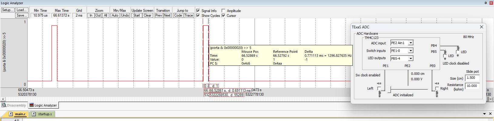
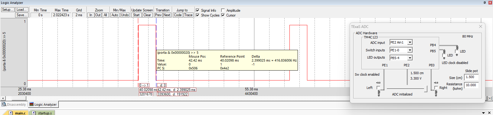

# ADC Control using TIVA Microcontroller

## Aim

To generate a PWM signal using **ADC input** and control the position of a **servo motor from 0° to 180°** using a potentiometer.

## Theory

An **Analog-to-Digital Converter (ADC)** converts a continuous analog voltage signal into its discrete digital representation. In embedded systems, sensors often produce analog outputs, which must be converted into digital form so that the microcontroller can process them.

The TM4C123GH6PM TIVA microcontroller contains a **12-bit ADC**, meaning it can represent an analog voltage using:

**2¹² = 4096 discrete levels**

Therefore, the ADC output ranges from **0 to 4095**.

When the reference voltage is **3.3 V**, the ADC resolution is approximately:

**3.3 V / 4096 ≈ 0.805 mV per ADC step**

Thus, every increment in ADC value corresponds to approximately **0.805 mV** change in the input voltage.

### ADC Working Principle

The ADC module samples the input voltage from an analog channel and converts it to a digital value through the following process:

1. **Sampling** – The input analog voltage is captured.
2. **Quantization** – The voltage range is divided into discrete levels.
3. **Encoding** – Each quantized level is represented as a binary number.

### ADC Configuration in TM4C123GH6PM

The ADC module uses **sample sequencers (SS0–SS3)** to manage sampling operations. In this experiment, **Sample Sequencer 3 (SS3)** is used because it captures one sample at a time and has the highest priority.

The main registers involved include:

* **SYSCTL_RCGC2_R** – Enables the clock for GPIO ports
* **GPIO_DIR** – Configures pin direction
* **GPIO_AFSEL** – Enables alternate functions
* **GPIO_DEN** – Enables digital functionality
* **GPIO_AMSEL** – Enables analog mode
* **SSPRI** – Sets sample sequencer priority
* **ACTSS** – Activates or disables sample sequencers
* **EMUX** – Selects the trigger source
* **SSMUX3** – Selects the analog input channel
* **SSCTL3** – Controls sample sequence behavior
* **PSSI** – Starts ADC sampling
* **RIS** – Indicates completion of conversion
* **ISC** – Clears interrupt flags
* **SSFIFO3** – Stores the ADC conversion result

### Servo Motor Control using PWM

A servo motor operates using a **PWM signal**. The pulse width determines the angular position of the servo.

| Pulse Width | Servo Angle |
| ----------: | ----------: |
|      0.7 ms |          0° |
|      1.5 ms |         90° |
|      2.3 ms |        180° |

The ADC value obtained from the potentiometer is mapped to the corresponding PWM pulse width, allowing the servo motor to rotate proportionally according to the potentiometer position.

### DC Motor Speed Control

A DC motor's speed can be controlled by varying the **PWM duty cycle**.

* **Low duty cycle → Low speed**
* **High duty cycle → High speed**

The ADC reading determines the duty cycle of the PWM output, allowing the potentiometer to control the motor speed.

## GPIO and ADC Configuration

The potentiometer is connected to an analog input of the TM4C123GH6PM. The analog input is configured using the ADC module and **Sample Sequencer 3**.

The ADC converts the potentiometer voltage into a 12-bit digital value ranging from **0 to 4095**.

The servo control signal is generated at **PA5**, which is configured as a digital output. The ADC value is used to vary the PWM pulse width applied to the servo.

As the potentiometer voltage increases, the ADC value increases, resulting in an increase in PWM pulse width and a corresponding change in servo position.

## Tools Required

* KEIL uVision4
* TIVA TM4C123GH6PM board
* DC Motor
* L293D Driver
* Regulated Power Supply Unit
* Potentiometer

## Summary

Implemented **ADC-based servo motor position control** using the TM4C123GH6PM TIVA microcontroller. The potentiometer provides a variable analog voltage from **0 V to 3.3 V**, which is converted into a **12-bit ADC value ranging from 0 to 4095**. The ADC result is then mapped to the PWM pulse width to control the servo position from **0° to 180°**. The experiment demonstrates ADC configuration, analog signal acquisition, digital signal processing, PWM generation, and actuator control using register-level Embedded C programming.

## Output

The servo motor position varies from **0° to 180°** based on the potentiometer position.

