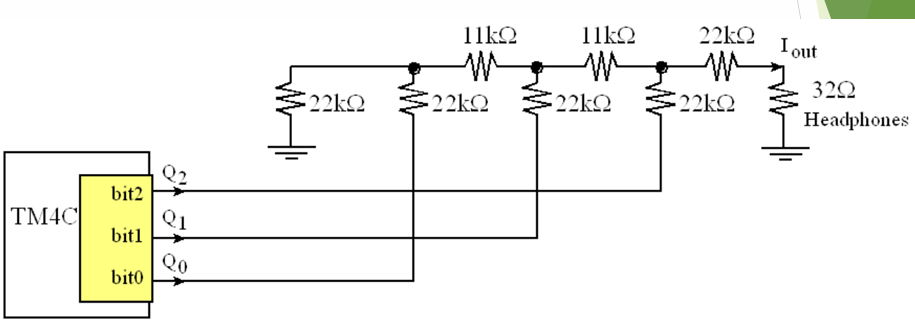
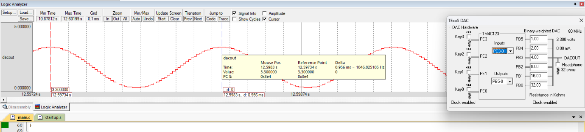

# DAC with TIVA Microcontroller

## Aim

To generate a **6-bit sine wave** using an external DAC at Port B and produce a **C note of approximately 1046.5 Hz** when the switch connected to **PE0** is pressed.

## Theory

### Digital-to-Analog Conversion

A **Digital-to-Analog Converter (DAC)** converts a discrete digital signal into a corresponding analog voltage. In embedded systems, microcontrollers process digital data, while applications such as **audio generation, sensor excitation, communication systems, and analog control** require analog signals.

The DAC provides the interface between digital processing and real-world analog signals.

### DAC Implementation using TM4C123GH6PM

The **TM4C123GH6PM** does not contain a dedicated DAC peripheral. Therefore, an external DAC circuit such as an **R-2R ladder** or binary-weighted resistor network can be connected to the GPIO pins.

In this experiment, a **6-bit DAC** is implemented using **PB0–PB5** of Port B.

A 6-bit DAC provides:

* Number of levels = **2⁶ = 64**
* Digital input range = **0–63**
* Reference voltage = **3.3 V**

The theoretical voltage resolution is:

**Resolution = 3.3 V / 63 ≈ 52.4 mV per step**

Thus, each increment in the digital input produces approximately a **52.4 mV change** in the DAC output voltage.

### DAC Working Principle

The DAC operates through the following process:

1. **Digital Input Application** – A 6-bit binary value is applied to GPIO pins **PB0–PB5**.
2. **Weighted Summation** – The R-2R resistor network converts the digital value into a proportional analog voltage.
3. **Signal Reconstruction** – Successive digital values produce discrete voltage levels that approximate a continuous waveform.

### R-2R Ladder DAC

The **R-2R ladder** is widely used for GPIO-based DAC implementation because it requires only two resistor values, **R and 2R**.

Its advantages include:

* Simple circuit implementation
* Only two resistor values are required
* Good linearity
* Easy interfacing with microcontroller GPIO pins

The analog output voltage is proportional to the digital input applied to PB0–PB5.

### Sine Wave Generation

A sine wave is generated using a **64-sample lookup table** stored in the microcontroller memory.

Each value in the lookup table represents one sample of the sine wave. During every SysTick interrupt, the next sample is written to Port B.

The sample index is incremented continuously and wraps around after 64 samples:

* Number of samples per cycle = **64**
* Each sample is converted into an analog voltage through the R-2R ladder.
* Repeated playback of the samples produces a periodic sine waveform.

### Timing Control Using SysTick

The **SysTick timer** is used to periodically update the DAC output.

During every SysTick interrupt:

* The next sine-wave sample is written to Port B.
* The sample index is incremented.
* After the final sample, the index returns to the first sample.

The output frequency depends on the sample update frequency and the number of samples per cycle:

**Output Frequency = Sampling Frequency / Number of Samples per Cycle**

Therefore, changing the SysTick reload value changes the sampling frequency and consequently changes the output tone.

For an **80 MHz system clock**, each clock cycle is:

**1 / 80 MHz = 12.5 ns**

The SysTick reload value determines the time interval between successive DAC samples.

### Sound Generation Principle

When the periodic analog waveform is applied to a buzzer or speaker:

* The **frequency** of the waveform determines the pitch.
* The **amplitude** determines the loudness.

For example:

**C note ≈ 1046.5 Hz**

The DAC generates the required audio frequency by controlling the rate at which the sine-wave samples are output.

### Switch-Based Sound Control

A switch connected to **PE0** is used as the trigger for sound generation.

When PE0 is pressed:

* The SysTick interrupt is enabled.
* The required SysTick reload value is loaded.
* The sine-wave samples are continuously sent to Port B.
* The R-2R ladder converts the digital samples into an analog waveform.
* The buzzer produces the corresponding C note.

When the switch is not pressed, the DAC output is cleared and the SysTick interrupt is disabled.

### Frequency Control for Musical Notes

Different musical notes can be generated by changing the **SysTick reload value**.

* **Higher reload value → Lower sampling frequency → Lower output frequency**
* **Lower reload value → Higher sampling frequency → Higher output frequency**

Therefore, different tones such as **C, D, E, and F** can be generated by using appropriate reload values.

### GPIO Configuration

The DAC uses the following GPIO configuration:

| Pin/Port | Configuration  | Purpose                  |
| -------- | -------------- | ------------------------ |
| PB0–PB5  | Digital Output | 6-bit DAC data           |
| PE0      | Digital Input  | Push-button/switch input |

Important registers include:

* **SYSCTL_RCGC2_R** – Enables the clock for GPIO ports.
* **GPIO_PORTB_DIR_R** – Configures PB0–PB5 as outputs.
* **GPIO_PORTB_DEN_R** – Enables digital functionality on PB0–PB5.
* **GPIO_PORTE_DIR_R** – Configures PE0 as an input.
* **GPIO_PORTE_DEN_R** – Enables digital functionality on PE0.

### SysTick Timer Registers

The SysTick timer is configured to periodically generate interrupts for DAC sample updates.

Important registers include:

* **NVIC_ST_CTRL_R** – Enables SysTick, selects the clock source, and enables interrupts.
* **NVIC_ST_RELOAD_R** – Stores the reload value that determines the sample update interval.
* **NVIC_ST_CURRENT_R** – Stores the current counter value; writing to it clears the counter.
* **NVIC_SYS_PRI3_R** – Configures the priority of the SysTick interrupt.

## Tools Required

* KEIL uVision4
* TIVA TM4C123GH6PM board
* R-2R Ladder DAC / Resistor network
* Buzzer
* Push button

## Summary

Implemented a **6-bit DAC using the R-2R ladder network** and GPIO pins **PB0–PB5** of the TM4C123GH6PM. A 64-sample sine-wave lookup table was used to generate a discrete sine waveform, while the **SysTick timer interrupt** controlled the sample update rate. A push button connected to **PE0** was used to trigger the waveform generation, producing an audible **C note of approximately 1046.5 Hz** through the buzzer. The experiment demonstrates GPIO-based DAC implementation, R-2R ladder operation, lookup-table waveform generation, SysTick interrupt configuration, and audio signal generation using register-level Embedded C programming.

## Output

