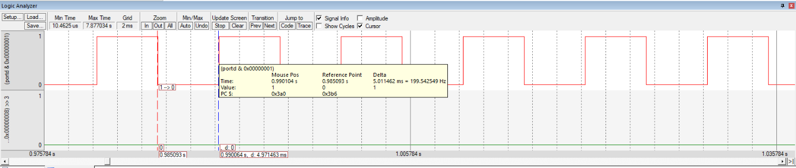

# DC Motor Control using SysTick Timer

## Aim

To generate a control signal at **PD0 and PD3** to run the DC motor in the **clockwise direction at minimum speed (50% duty cycle)** using the SysTick timer.

## Theory

A **DC motor** converts electrical energy into mechanical energy. It consists of a stator, usually made using permanent magnets, and a rotor or armature winding. When current flows through the armature, a magnetic field is created which interacts with the stator field and produces torque, resulting in rotation.

The direction and speed of the DC motor can be controlled by varying the control signals applied to the motor driver pins. The **SysTick timer** is used to generate precise time delays required to create PWM signals for controlling the motor speed.

### DC Motor Working Principle

A DC motor consists of:

* **Stator** – usually permanent magnets that create a magnetic field
* **Rotor (armature)** – coil carrying current

When current flows through the armature:

* A magnetic field is produced.
* It interacts with the stator field.
* A force is generated.
* This produces torque, causing the rotor to rotate.

### Speed Control using PWM Principle

Motor speed depends on the **average voltage** applied to the motor. This can be controlled using a pulse signal.

* **Higher duty cycle** → higher average voltage → faster motor
* **Lower duty cycle** → lower average voltage → lower motor speed

In this experiment, a **50% duty cycle** is used for minimum speed operation.

### Direction Control

The motor direction is controlled by applying the pulse signal to different control lines of the motor driver.

| Control Pin 1 | Control Pin 2 | Operation               |
| ------------- | ------------- | ----------------------- |
| 0             | 0             | Motor OFF               |
| Pulse         | 0             | Clockwise rotation      |
| 0             | Pulse         | Anti-clockwise rotation |
| Pulse         | Pulse         | No movement             |

### SysTick Timer

The **SysTick timer** is a built-in system timer used for generating precise time delays.

It works using:

* **Reload register** – holds the delay count value
* **Current register** – counts down to zero
* **Control register** – enables the timer and selects the clock source

The reload value is calculated based on the required delay and the system clock period.

For an **80 MHz system clock**, the clock period is **12.5 ns**.

The SysTick timer is used to generate the required ON and OFF times for the motor control signal.

## GPIO Configuration

The **PD0 and PD3** pins are configured as digital outputs and are used to provide control signals to the motor driver.

For the 50% duty cycle operation:

* HIGH duration = **5 ms**
* LOW duration = **5 ms**
* Total period = **10 ms**
* Duty cycle = **50%**

The SysTick timer generates the required 5 ms delay between the HIGH and LOW states of the control signal.

## Tools Required

* KEIL uVision4
* TIVA TM4C123GH6PM board
* DC Motor
* L293D Driver
* Regulated Power Supply Unit

## Summary

Implemented **DC motor speed and direction control using the SysTick timer** and GPIO pins of the TM4C123GH6PM. The experiment demonstrates PWM-based speed control, direction control using motor driver inputs, SysTick-based time delay generation, and GPIO interfacing. A **50% duty cycle** was used to generate 5 ms ON and 5 ms OFF intervals for minimum-speed clockwise motor operation.

## Output

Add the PWM waveform screenshot here.

