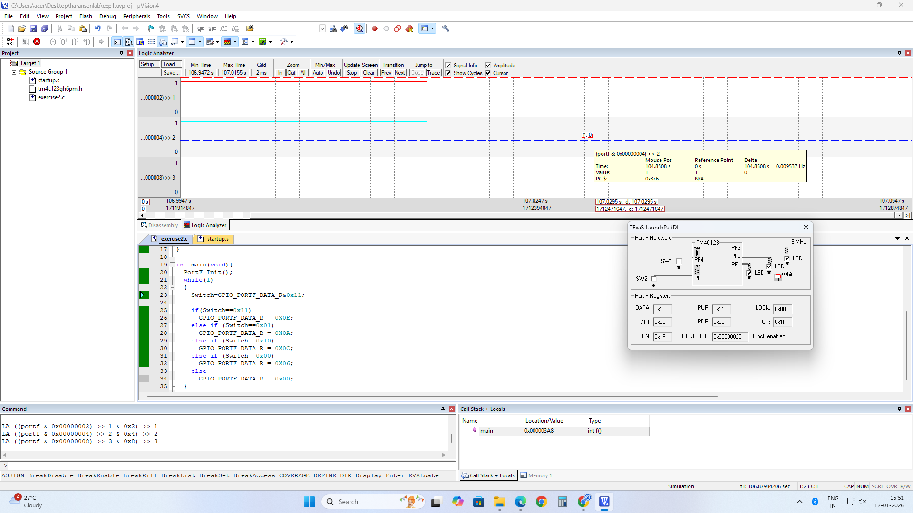
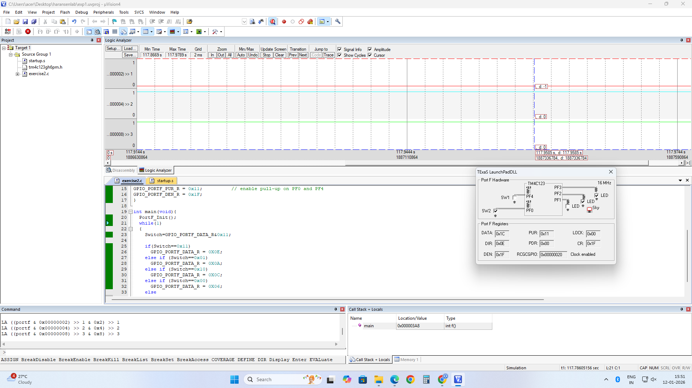
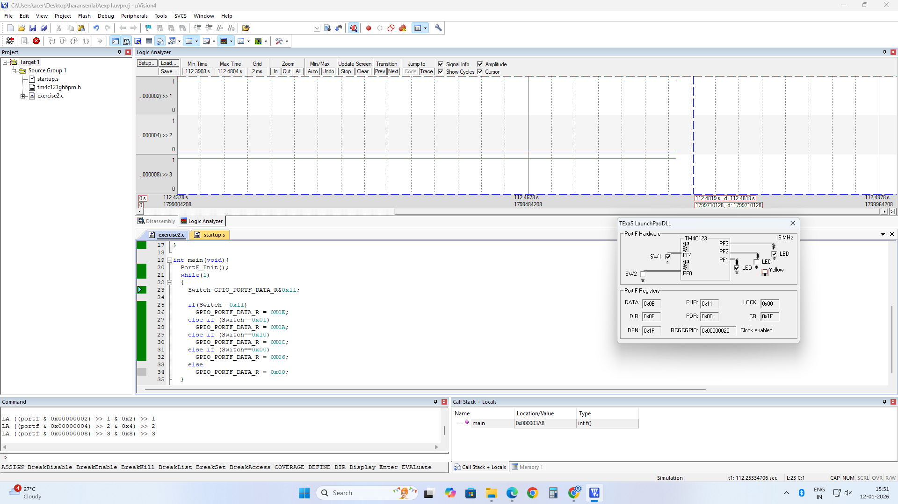
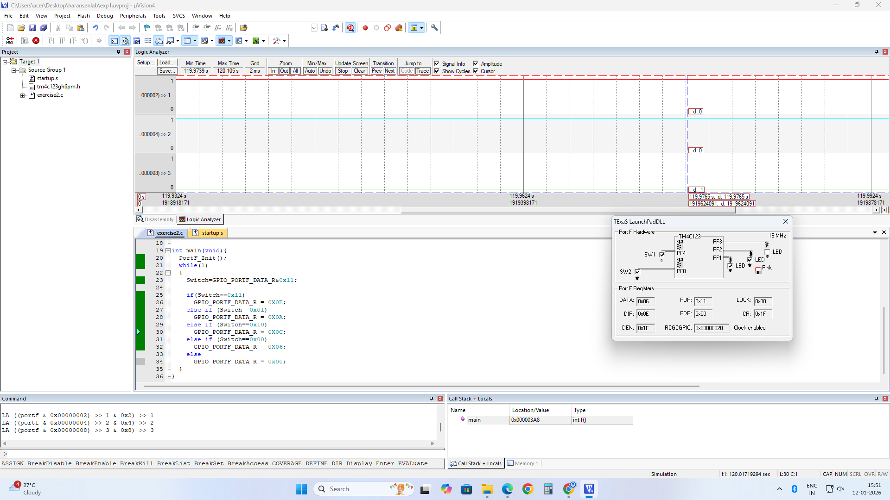

# LED and Switch Interface

## Objective

Interface **SW1** and control **LED (R, G, or B)**. Observe the waveforms in debug mode.

## GPIO Module Overview

The GPIO (General-Purpose Input/Output) module provides the interface between the microcontroller processor and the external world. It enables communication with sensors, actuators, switches, and LEDs through programmable input/output pins.

### TIVA TM4C123GH6PM Specifications

- **Total Programmable I/O Pins:** 43
- **GPIO Ports:** 6 (Port A through Port F)
- **Special Port:** Port F contains onboard RGB LED and two onboard switches (negative logic)
- **System:** Cortex-M4 ARM processor with 16 MHz clock

## Port F Architecture and Pin Configuration

| Pin | Function |
|---|---|
| PF0 | Switch SW2 |
| PF1 | Red LED |
| PF2 | Blue LED |
| PF3 | Green LED |
| PF4 | Switch SW1 |

**Negative Logic:** When a switch is pressed, the input reads LOW (0); when released, the input reads HIGH (1) due to pull-up resistor configuration.

## GPIO Register Configuration Sequence

1. **SYSCTL_RCGC2_R:** Enable clock for GPIO port
2. **GPIO_PORTF_LOCK_R:** Unlock GPIO Port F
3. **GPIO_PORTF_CR_R:** Allow changes to specified pins
4. **GPIO_PORTF_AMSEL_R:** Disable analog functionality
5. **GPIO_PORTF_PCTL_R:** Configure pins as GPIO
6. **GPIO_PORTF_DIR_R:** Configure input/output direction
7. **GPIO_PORTF_AFSEL_R:** Disable alternate functions
8. **GPIO_PORTF_PUR_R:** Enable pull-up resistors
9. **GPIO_PORTF_DEN_R:** Enable digital I/O

## Pin Configuration Values

**DIR:** `0x0E`  
PF4 and PF0 → Input  
PF3, PF2 and PF1 → Output

**DEN:** `0x1F`  
Enables digital I/O on PF4–PF0.

**PUR:** `0x11`  
Enables pull-ups on PF4 and PF0.

## Tools Required

- KEIL uVision4
- TIVA TM4C123GH6PM board

## Summary

Implemented GPIO interfacing on the TIVA TM4C123GH6PM LaunchPad using register-level Embedded C programming. Configured Port F for switch inputs and RGB LED outputs, including internal pull-up resistors for negative-logic switch operation. The GPIO signals were monitored in Keil debug mode to observe the real-time behavior of the switch and LED control.

## Output

### SW1 OFF – SW2 OFF

### SW1 OFF – SW2 ON

### SW1 ON – SW2 OFF

### SW1 ON – SW2 ON

