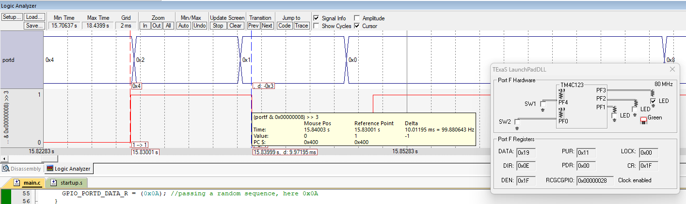

# Periodic Interrupt using SysTick Timer

## Aim

To generate control sequences on **PD0–PD3** while toggling an LED every **10 ms** using the **SysTick interrupt**.

## Theory

### SysTick Timer

The **SysTick timer** is a 24-bit down counter available in ARM Cortex-M processors. It is mainly used to generate periodic interrupts at fixed time intervals.

The SysTick timer can be configured to generate an interrupt whenever the counter reaches zero. After reaching zero, the counter reloads the predefined reload value and continues counting.

The direction and speed of a DC motor can be controlled by varying the control signals applied to the motor driver pins. The SysTick timer can be used to generate precise time intervals required for generating PWM signals for motor speed control.

### SysTick Initialization Steps

The SysTick timer is initialized using the following sequence:

1. Disable SysTick by clearing the **ENABLE** bit in STCTRL.
2. Load the required value into the **STRELOAD** register.
3. Clear the current register by writing any value to **STCURRENT**.
4. Configure the SysTick control register:

   * **CLK_SRC = 1** → System clock
   * **INTEN = 1** → Enable interrupt
   * **ENABLE = 1** → Enable counter

For an **80 MHz system clock**, the clock period is **12.5 ns**.

For a **10 ms delay**, the required reload value is **800,000 clock cycles**.

### Direction Control

Motor direction is controlled by applying the pulse signal to different control lines.

| Control Pin 1 | Control Pin 2 | Operation               |
| ------------- | ------------- | ----------------------- |
| 0             | 0             | Motor OFF               |
| Pulse         | 0             | Clockwise rotation      |
| 0             | Pulse         | Anti-clockwise rotation |
| Pulse         | Pulse         | No movement             |

### GPIO Configuration

To configure **PD0–PD3** as digital outputs:

1. Enable the Port D clock using **SYSCTL_RCGC2_R**.
2. Disable analog functionality using **AMSEL**.
3. Clear the corresponding **PCTL** fields.
4. Set the direction using **DIR**.
5. Disable alternate functions using **AFSEL**.
6. Enable digital functionality using **DEN**.

Port F is also configured to control the onboard RGB LED. In the interrupt service routine, the LED connected to **PF3** is toggled every 10 ms.

## Tools Required

* KEIL uVision4
* TIVA TM4C123GH6PM board
* DC Motor
* L293D Driver
* Regulated Power Supply Unit

## Summary

Implemented **periodic interrupt generation using the SysTick timer** of the TM4C123GH6PM. The SysTick timer was configured to generate an interrupt every **10 ms**, during which the onboard LED was toggled. GPIO pins PD0–PD3 were configured as digital outputs to generate different control sequences. The experiment demonstrates SysTick interrupt configuration, GPIO interfacing, periodic event generation, and timer-based control using register-level Embedded C programming.

## Output

