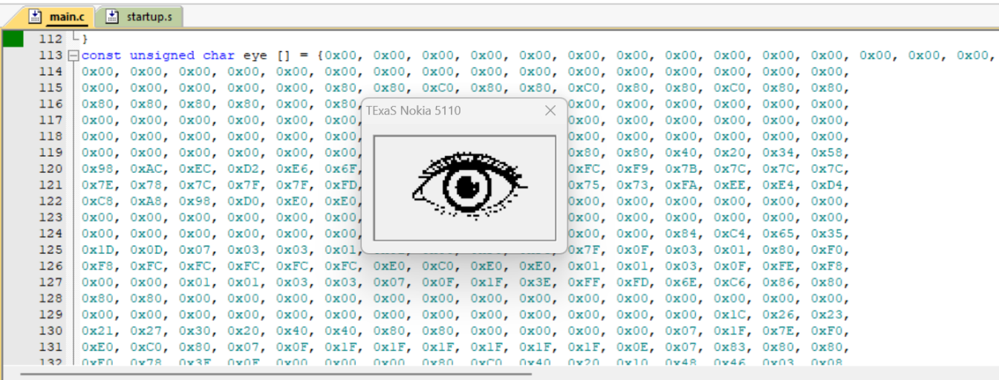

# SSI with TIVA Microcontroller

## Aim

To display a **bitmap picture** on the Nokia 5110 LCD using the **SSI communication interface** of the TM4C123GH6PM microcontroller.

## Theory

### Synchronous Serial Interface (SSI)

The **Synchronous Serial Interface (SSI)** is a synchronous serial communication peripheral used for data transfer between a master device and one or more slave devices. The TM4C123GH6PM supports SSI communication and can operate using different serial communication frame formats.

SSI provides:

* Synchronous data transfer using a common clock
* Master and slave operating modes
* Full-duplex communication capability
* Multiple frame formats, including:

  * Freescale SPI
  * Texas Instruments SSI
  * Microwire

### SSI Signals

The main signals used in synchronous serial communication are:

| Signal                  | Description                                              |
| ----------------------- | -------------------------------------------------------- |
| **SS / Slave Select**   | Selects the slave device                                 |
| **SCLK / Serial Clock** | Clock signal generated by the master                     |
| **MOSI**                | Master Out Slave In; transfers data from master to slave |
| **MISO**                | Master In Slave Out; transfers data from slave to master |

For the Nokia 5110 LCD, the microcontroller primarily transmits data and commands to the display.

### SSI Clock Configuration

The SSI serial clock frequency is determined by the system clock, clock prescaler, and serial clock rate.

The clock configuration depends on:

* **CPSDVSR** – Clock prescale divisor, which must be an even value from 2 to 254.
* **SCR** – Serial Clock Rate, which determines the additional clock division.

The SSI clock frequency is determined by the selected system clock and these divider values.

### SSI Registers Used

The following registers are used to configure and operate SSI0:

* **SYSCTL_RCGC1_R** – Enables the clock for the SSI peripheral.
* **SSI0_CR1_R** – Configures master/slave operation and enables the SSI module.
* **SSI0_CC_R** – Selects the SSI clock source.
* **SSI0_CPSR_R** – Configures the clock prescaler.
* **SSI0_CR0_R** – Configures frame format, clock parameters, and data size.
* **SSI0_DR_R** – SSI data register used to transmit and receive data.
* **SSI0_SR_R** – SSI status register used to monitor the state of the SSI peripheral.

### Nokia 5110 LCD Interface

The **Nokia 5110 LCD** is a graphical LCD with a resolution of **84 × 48 pixels**. It communicates with the microcontroller using a synchronous serial interface.

The LCD receives two main types of information:

* **Command data** – Used to configure the LCD and control its operation.
* **Display data** – Contains the pixel information that is displayed on the screen.

A control signal is used to distinguish between command and display data.

### Bitmap Image Display

A bitmap picture can be converted into an array of hexadecimal pixel values using software such as **LCD Assistant**.

The converted array is stored in the microcontroller program memory. The microcontroller then:

1. Initializes the Nokia 5110 LCD.
2. Clears the display.
3. Sets the LCD cursor to the starting position.
4. Reads the bitmap array sequentially.
5. Sends each byte through SSI.
6. The LCD converts the received data into pixels on the display.

The Nokia 5110 display contains:

* Width = **84 pixels**
* Height = **48 pixels**

The total display memory required for a monochrome image is:

**84 × 48 / 8 = 504 bytes**

Therefore, a full-screen bitmap requires **504 bytes** of display data.

### LCD Initialization

Before transmitting the image data, the LCD is initialized using a sequence of commands. These commands configure parameters such as:

* LCD operating mode
* Contrast
* Temperature coefficient
* Bias system
* Display mode

After initialization, the LCD is ready to receive display data.

### GPIO Configuration

The SSI peripheral uses GPIO pins configured for their corresponding alternate functions.

The required GPIO configuration includes:

* Enabling the GPIO port clock.
* Configuring the SSI pins for alternate functionality.
* Enabling digital functionality.
* Configuring the required control pins for LCD operation.
* Selecting the appropriate SSI peripheral function through the **GPIO PCTL register**.

The control signals for **DC (Data/Command)** and **RESET** are also configured as GPIO outputs.

## Tools Required

* KEIL uVision4
* TIVA TM4C123GH6PM board
* Nokia 5110 LCD Module
* LCD Assistant Software

## Summary

Implemented **SSI-based communication between the TM4C123GH6PM and a Nokia 5110 graphical LCD**. The SSI0 peripheral was configured in master mode to transmit commands and bitmap data to the LCD. A bitmap picture was converted into pixel data and stored as an array in the microcontroller memory, which was then transmitted to the LCD through the SSI interface. The experiment demonstrates SSI configuration, synchronous serial data transfer, LCD initialization, bitmap data transmission, and graphical display interfacing using register-level Embedded C programming.

## Output

The bitmap picture is successfully displayed on the Nokia 5110 LCD.

