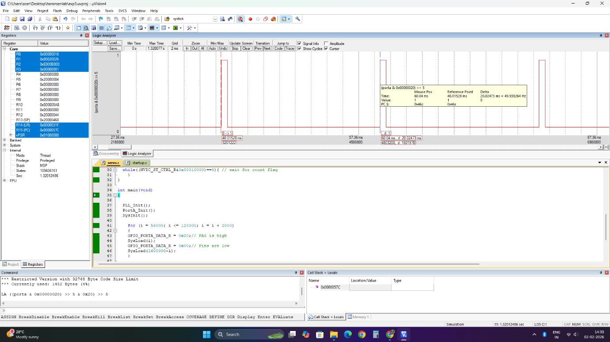

# Servo Motor Control with SysTick Timer

## Aim

To generate a PWM signal at **PA5** to rotate the servo motor from **0° to 90° and 90° to 0°** using the SysTick timer.

## Theory

A **servo motor** is a rotary actuator that provides precise control of angular position. It consists of a DC motor, gears, a feedback potentiometer, and a control circuit. Servo motors are widely used in robotics and embedded systems where accurate position control is required.

A servo motor is controlled using a **Pulse Width Modulated (PWM) signal**. The PWM signal has a fixed frequency of **50 Hz**, which means the pulse repeats every **20 ms**. The width of the pulse determines the angular position of the servo shaft.

The standard pulse durations used in this experiment are:

* **0° → 0.7 ms → Reload value = 56,000**
* **90° → 1.5 ms → Reload value = 120,000**
* **180° → 2.3 ms → Reload value = 184,000**

The total PWM period is **20 ms**, corresponding to a reload value of **1,600,000**.

The **SysTick timer** is a 24-bit down counter used to generate accurate time delays required for PWM signal generation. By varying the HIGH pulse duration while maintaining a total period of 20 ms, different angular positions of the servo motor can be obtained.

## GPIO Configuration

The **PA5** pin is configured as a digital output and is used to generate the PWM control signal for the servo motor.

The SysTick timer is used to generate the required HIGH and LOW durations of the PWM signal.

For servo position control:

* **0° → HIGH duration = 0.7 ms**
* **90° → HIGH duration = 1.5 ms**
* **180° → HIGH duration = 2.3 ms**
* **Total PWM period = 20 ms**

For the required **0° to 90° movement**, the pulse width is gradually increased from **0.7 ms to 1.5 ms**. The pulse width is then gradually decreased from **1.5 ms to 0.7 ms** to move the servo from **90° back to 0°**.

## Tools Required

* KEIL uVision4
* TIVA TM4C123GH6PM board
* Servo Motor

## Summary

Implemented **servo motor position control** using the **SysTick timer** and software-based PWM generation on PA5 of the TM4C123GH6PM. The experiment demonstrates SysTick timer configuration, reload value calculation, GPIO output control, PWM generation, and controlled servo movement between **0° and 90°** using register-level Embedded C programming.

## Output

