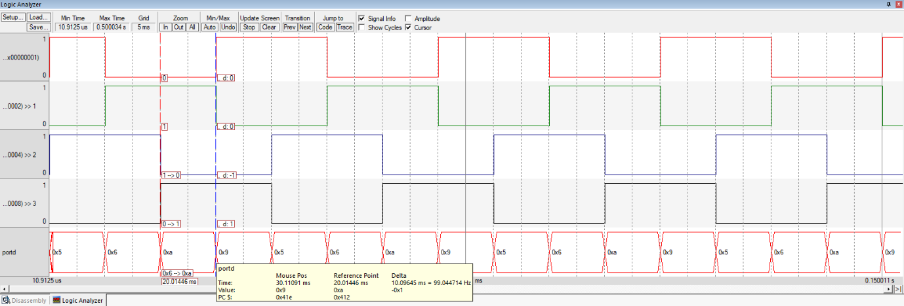

# Stepper Motor Control using SysTick Timer

## Aim

To generate a control signal sequence at **PD0–PD3** to rotate the stepper motor by **90° in the clockwise direction**.

## Theory

A **stepper motor** is a brushless, synchronous motor that converts digital electrical pulses into discrete mechanical movements. Each pulse causes the motor shaft to rotate by a fixed angle called the **step angle**. The total angular displacement depends on the number of steps applied, and the rotational speed depends on the pulse frequency.

For a typical **1.8° step angle motor**, each step produces an angular displacement of 1.8°. Therefore, the required number of steps for a given angular displacement can be calculated based on the step angle.

Stepper motors are widely used in positioning applications because they provide precise control without requiring feedback systems.

In this experiment, the **bipolar 2-phase ON method** was used. In this method, two phases are energized at a time, producing better torque. The four-step excitation sequence rotates the motor in either clockwise or anticlockwise direction depending on the order of energizing the phases.

The **SysTick timer** was used to generate accurate delays between successive phase excitation signals. The reload value is calculated based on the required delay and the system clock frequency.

For an **80 MHz system clock**, the clock period is **12.5 ns**. For a **10 ms delay**, the required SysTick reload value corresponds to **800,000 clock cycles**.

This value is loaded into the SysTick reload register to generate precise timing control.

## GPIO Configuration

GPIO initialization steps included:

* Enabling the Port D clock
* Configuring **PD0–PD3** as digital outputs
* Disabling alternate functions
* Disabling analog functions
* Enabling digital functionality

The GPIO pins PD0–PD3 are used to provide the phase excitation sequence required to drive the stepper motor.

The rotation angle is controlled by the number of steps applied to the motor. For a **1.8° step angle motor**, the angular displacement depends on the number of steps generated.

## L293D Driver and Regulated Power Supply

In this experiment, the stepper motor was interfaced using an **L293D motor driver IC** along with a **regulated power supply unit**.

The L293D acts as a **dual H-bridge driver**, allowing safe control of the bipolar stepper motor by providing sufficient current and isolating the microcontroller from high-power loads. Since the microcontroller cannot supply the required current directly to drive the motor coils, the L293D receives the control signals from the GPIO pins and drives the motor phases accordingly.

A regulated power supply was used to provide stable and constant voltage to the driver and motor, ensuring smooth operation without voltage fluctuations, overheating, or erratic rotation. This setup enabled reliable and efficient stepper motor control.

## Tools Required

* KEIL uVision4
* TIVA TM4C123GH6PM board
* Stepper Motor – 1.8° step
* L293D Driver
* Regulated Power Supply Unit

## Summary

Implemented **bipolar stepper motor control using the SysTick timer** and GPIO pins PD0–PD3 of the TM4C123GH6PM. The experiment demonstrates phase excitation sequence generation, SysTick-based **10 ms delay generation**, GPIO configuration, and angular position control. The L293D driver was used to interface the microcontroller with the stepper motor and provide the required drive current.

## Output

