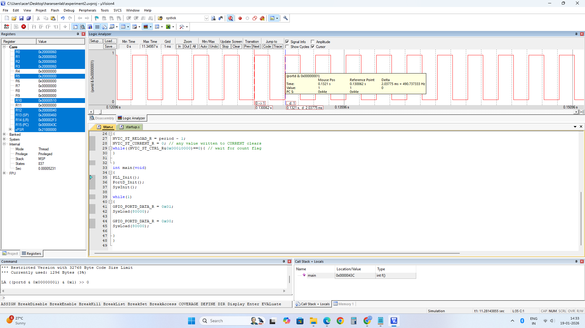

# Time Delay Generation using SysTick Timer

## Aim

To generate a square wave of **500 Hz frequency with 50% duty cycle** at pin **PD0** using the SysTick timer.

## Theory

The **SysTick timer** is a 24-bit down counter that operates using the system clock or an external reference clock. When the counter reaches zero, a flag is set, and the counter reloads automatically with a predefined value. This feature makes the SysTick timer suitable for delay generation, square wave generation, and time interval measurement.

The SysTick timer consists of three main registers:

* **SysTick Control and Status Register (STCTRL):** Used to enable or disable the timer, select the clock source, and monitor the count flag.
* **SysTick Reload Register (STRELOAD):** Holds the reload value, which determines the time delay period.
* **SysTick Current Value Register (STCURRENT):** Stores the present value of the counter. Writing any value to this register clears the counter.

The time delay generated by the SysTick timer depends on the system clock frequency. For a system clock of **80 MHz**, each clock cycle takes **12.5 ns**.

The required reload value for a desired delay is calculated using:

**Reload Value = Desired Time Delay / Clock Period**

By loading the calculated value into the **STRELOAD** register and enabling the SysTick timer, precise time delays can be generated. By toggling a GPIO pin after each delay, square waves with the required frequency and duty cycle can be produced.

## GPIO Configuration

The **PD0** pin is configured as a digital output. The SysTick timer is used to generate the required delay between the HIGH and LOW states of PD0.

For a **500 Hz square wave**:

* Frequency = **500 Hz**
* Time period = **2 ms**
* Duty cycle = **50%**
* HIGH duration = **1 ms**
* LOW duration = **1 ms**

With an **80 MHz system clock**, a 1 ms delay corresponds to **80,000 clock cycles**.

## Tools Required

* KEIL uVision4
* TIVA TM4C123GH6PM board

## Summary

Implemented a **500 Hz, 50% duty-cycle square wave** on PD0 using the **SysTick timer** of the TM4C123GH6PM. The experiment demonstrates SysTick timer configuration, reload value calculation, GPIO output control, and software-based time delay generation using register-level Embedded C programming.

## Output

Add the waveform screenshot here.

