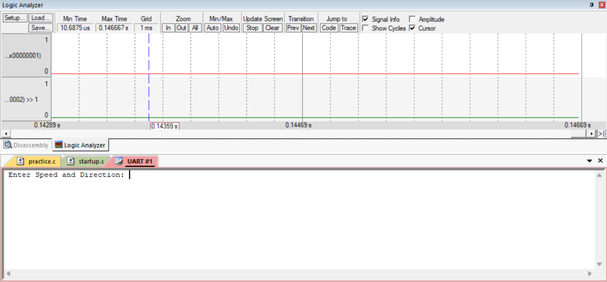
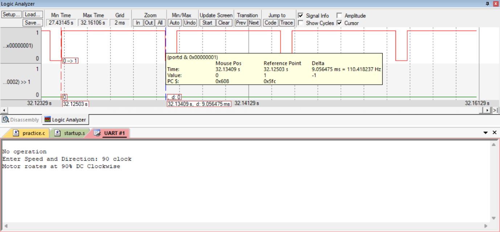
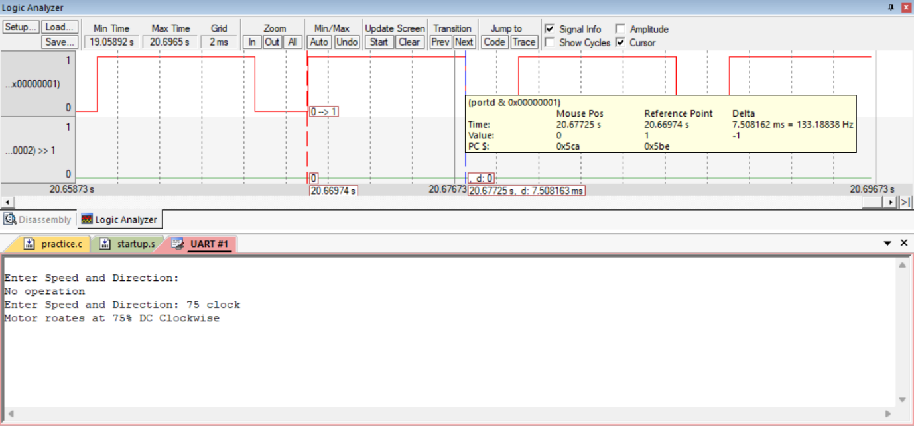

# UART Controlled DC Motor Speed and Direction

## Aim

To control the **speed and direction of a DC motor** using UART commands received from a PC through the TM4C123GH6PM TIVA C Series microcontroller.

## Theory

### UART-Based Motor Control

UART (Universal Asynchronous Receiver/Transmitter) provides asynchronous serial communication between the **PC and the TM4C123GH6PM** without requiring a common clock signal.

In this experiment, commands are entered through a serial terminal on the PC. The microcontroller receives the command through **UART0**, compares it with predefined commands, and generates the corresponding control signals for the DC motor.

The UART communication uses:

* **PA0 → UART0 RX**
* **PA1 → UART0 TX**

The received command contains both the required **motor speed and direction**.

Examples include:

* `50 clock`
* `50 anticlock`
* `75 clock`
* `90 clock`
* `90 anticlock`

### UART Communication

The UART is configured for serial data transmission and reception using polling.

The microcontroller:

1. Sends a prompt to the PC.
2. Receives the speed and direction command.
3. Stores the received characters in a string buffer.
4. Compares the received command with predefined strings.
5. Generates the corresponding motor control signal.
6. Sends a status message back to the PC.

The UART status register is continuously checked to determine whether data is available for reception or whether the transmit buffer is ready.

### UART Configuration

UART0 is configured using the following registers:

* **UART0_CTL_R** – Enables or disables UART operation.
* **UART0_IBRD_R** – Configures the integer part of the baud-rate divisor.
* **UART0_FBRD_R** – Configures the fractional part of the baud-rate divisor.
* **UART0_LCRH_R** – Configures the UART line control and data format.
* **UART0_DR_R** – Used for transmitting and receiving data.
* **UART0_FR_R** – Used to monitor UART status flags.

The GPIO pins PA0 and PA1 are configured for the UART alternate function using the GPIO PCTL register.

### DC Motor Speed Control

The speed of the DC motor is controlled using the **PWM principle**.

The average voltage applied to the motor depends on the PWM duty cycle:

* Lower duty cycle → Lower average voltage → Lower speed
* Higher duty cycle → Higher average voltage → Higher speed

The experiment implements:

| Command        | Duty Cycle | Direction     |
| -------------- | ---------: | ------------- |
| `50 clock`     |        50% | Clockwise     |
| `50 anticlock` |        50% | Anticlockwise |
| `75 clock`     |        75% | Clockwise     |
| `90 clock`     |        90% | Clockwise     |
| `90 anticlock` |        90% | Anticlockwise |

### Direction Control

The motor is controlled through two GPIO outputs connected to the motor driver.

| PD0 | PD1 | Motor Operation |
| --: | --: | --------------- |
|   0 |   0 | Motor OFF       |
|   1 |   0 | Clockwise       |
|   0 |   1 | Anticlockwise   |
|   1 |   1 | Not used        |

In the program:

* **PD0 = 1** generates the clockwise control signal.
* **PD1 = 1** generates the anticlockwise control signal.

An **H-bridge motor driver** is used to interface the microcontroller with the DC motor and provide the required motor current.

### PWM Generation using SysTick

The **SysTick timer** is used to generate the timing required for PWM control.

For example, for 50% duty cycle:

* HIGH time = 5 ms
* LOW time = 5 ms
* Total period = 10 ms

For 75% duty cycle:

* HIGH time = 7.5 ms
* LOW time = 2.5 ms

For 90% duty cycle:

* HIGH time = 9 ms
* LOW time = 1 ms

With an **80 MHz system clock**, one clock cycle corresponds to **12.5 ns**.

The SysTick reload value is calculated based on the required ON and OFF time.

### GPIO Configuration

The following GPIO pins are used:

| Pin | Function                      |
| --- | ----------------------------- |
| PA0 | UART0 RX                      |
| PA1 | UART0 TX                      |
| PD0 | Motor control – Clockwise     |
| PD1 | Motor control – Anticlockwise |

Port D pins PD0 and PD1 are configured as digital outputs and connected to the motor driver.

### Command Processing

The `UART_InString()` function receives the complete command from the PC and stores it in a character buffer.

The received command is then compared using string comparison.

For example:

* `50 clock` → Generates 50% PWM on PD0.
* `50 anticlock` → Generates 50% PWM on PD1.
* `75 clock` → Generates 75% PWM on PD0.
* `90 clock` → Generates 90% PWM on PD0.
* `90 anticlock` → Generates 90% PWM on PD1.

If an invalid command is entered, the motor is stopped and the message **"No operation"** is displayed.

## Tools Required

* KEIL uVision4
* TIVA TM4C123GH6PM board
* DC Motor
* L293D Driver
* Regulated Power Supply Unit
* PuTTY Software
* PC

## Summary

Implemented **UART-based DC motor speed and direction control** using the TM4C123GH6PM. UART0 was used to receive motor commands from a PC through a serial terminal. The received commands were processed to control the **speed and direction of the motor** using GPIO pins PD0 and PD1. The SysTick timer was used to generate PWM timing for **50%, 75%, and 90% duty cycles**, while the motor driver provided the required interface between the microcontroller and DC motor. The experiment demonstrates UART communication, command processing, PWM generation, motor speed control, and H-bridge-based direction control using register-level Embedded C programming.

## Output

The motor response and corresponding UART commands are shown below.

