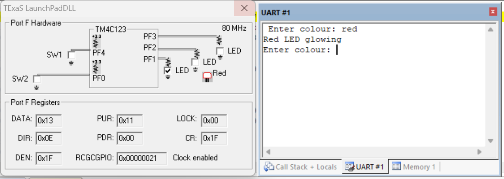
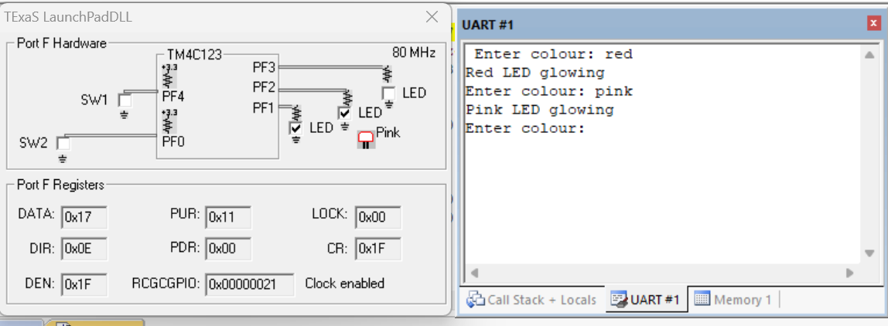
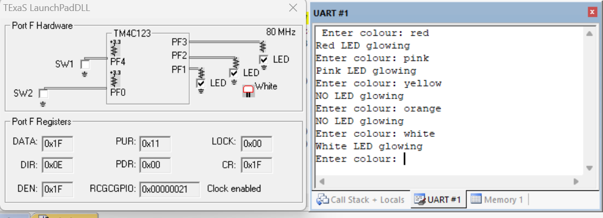

# UART with TIVA Microcontroller

## Aim

To control the **onboard RGB LED** of the TM4C123GH6PM using **UART commands received from a PC**.

## Theory

### What is UART?

**UART (Universal Asynchronous Receiver/Transmitter)** is a hardware communication protocol used for serial data transmission between electronic devices.

UART is:

* **Asynchronous** – no common clock signal is required.
* Based on two main communication lines:

  * **TX (Transmit)**
  * **RX (Receive)**

Data is transmitted in the form of frames consisting of:

* Start bit
* Data bits
* Optional parity bit
* Stop bit

For reliable communication, both the transmitter and receiver must be configured with the same **baud rate** and compatible frame format.

### UART Initialization

UART initialization involves configuring the UART peripheral and its associated GPIO pins.

The main configuration steps include:

1. Enable the clock for the UART module.
2. Enable the clock for the GPIO port.
3. Disable UART before configuration.
4. Configure the baud rate.
5. Configure the data format.
6. Enable UART.
7. Configure the GPIO pins for UART alternate functions.

For UART0 on the TM4C123GH6PM:

* **PA0 → UART0 RX**
* **PA1 → UART0 TX**

The baud-rate configuration uses integer and fractional baud-rate divisors.

The integer divisor is configured using:

**UART0_IBRD_R**

The fractional divisor is configured using:

**UART0_FBRD_R**

The line control register **UART0_LCRH_R** is used to configure the data format.

### UART Registers Used

Important UART registers used in the experiment include:

* **SYSCTL_RCGC1_R** – Enables the UART peripheral clock.
* **SYSCTL_RCGC2_R** – Enables the GPIO port clock.
* **UART0_CTL_R** – Enables or disables UART operation.
* **UART0_IBRD_R** – Stores the integer part of the baud-rate divisor.
* **UART0_FBRD_R** – Stores the fractional part of the baud-rate divisor.
* **UART0_LCRH_R** – Configures word length, FIFO, and other line-control settings.
* **UART0_DR_R** – Data register used for transmission and reception.
* **UART0_FR_R** – Flag register used to monitor UART status.

### UART Communication

UART transmits data serially through the TX line and receives data through the RX line.

The basic transmission sequence is:

1. Start bit – logic 0
2. Data bits – transmitted LSB first
3. Stop bit – logic 1

Since UART is asynchronous, synchronization is achieved using the configured baud rate and start/stop bits rather than a separate clock signal.

### Polling Method

In this experiment, **polling** is used for UART communication.

For transmission:

* The microcontroller checks the UART transmit FIFO status.
* It waits until space is available.
* The data is written to the UART data register.

For reception:

* The microcontroller checks the UART receive FIFO status.
* It waits until data is available.
* The received character is read from the UART data register.

The microcontroller continuously checks the UART status flags while executing the main program.

### UART String Reception

The program receives a complete command string from the PC.

The `UART_InString()` function:

* Receives characters one by one.
* Stores them in a character buffer.
* Echoes the received characters back to the PC.
* Handles the backspace character.
* Terminates the string when the **carriage return (CR)** is received.
* Adds a null character at the end of the string.

The received command is then compared with predefined color names.

### RGB LED Control

The onboard RGB LED is connected to **Port F**.

The individual LED components are controlled using:

* **PF1 – Red**
* **PF2 – Blue**
* **PF3 – Green**

Different combinations of these three outputs produce different colors.

| Command       | LED Output         |
| ------------- | ------------------ |
| `red`         | Red                |
| `blue`        | Blue               |
| `green`       | Green              |
| `yellow`      | Red + Green        |
| `cyan`        | Blue + Green       |
| `pink`        | Red + Blue         |
| `white`       | Red + Blue + Green |
| Other command | LED OFF            |

The received command is compared using string comparison, and the corresponding Port F output value is written to the GPIO data register.

### GPIO Configuration

The UART and RGB LED use the following GPIO configuration:

| Pin | Function  |
| --- | --------- |
| PA0 | UART0 RX  |
| PA1 | UART0 TX  |
| PF1 | Red LED   |
| PF2 | Blue LED  |
| PF3 | Green LED |

For UART operation, PA0 and PA1 are configured for their **UART alternate functions** using the GPIO PCTL register.

Port F is configured as a digital output for RGB LED control.

## Tools Required

* KEIL uVision4
* TIVA TM4C123GH6PM board
* PuTTY Software
* PC

## Summary

Implemented **UART-based RGB LED control** using the TM4C123GH6PM. UART0 was configured for serial communication between the TIVA microcontroller and a PC, with PA0 and PA1 used as RX and TX respectively. Commands entered through a serial terminal were received using the **polling method**, processed as strings, and used to control the onboard RGB LED. The experiment demonstrates UART initialization, baud-rate configuration, serial data transmission and reception, string processing, GPIO control, and PC-to-microcontroller communication using register-level Embedded C programming.

## Output

The RGB LED responds to the color commands entered through the PC serial terminal.

